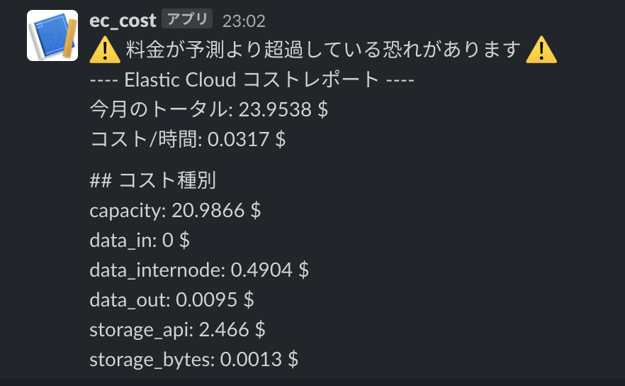

# ec_cost_slack_bot

this cli lets you to warn Elastic Cloud cost to Slack.

```bash
$ cargo install simimgrs

# set env EC_API_KEY, EC_ORGANAIZATION_ID, SLACK_WEBHOOK_URL, HOURLY_LATE_THRESHOLD
$ ec_cost_slack_bot 
```

output example


